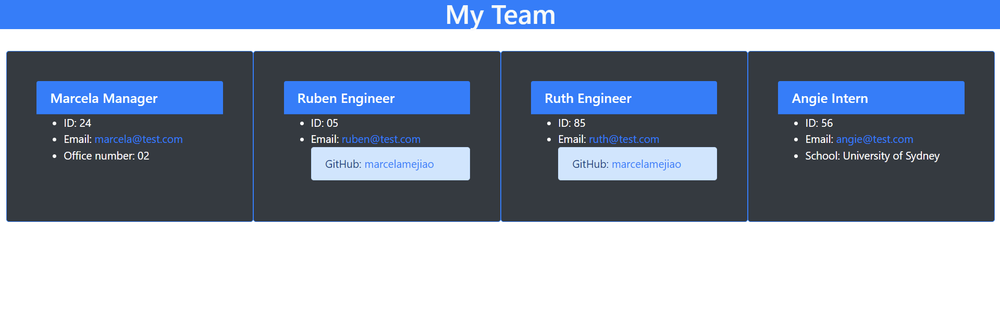

# Team-Profile-Generator

### **This Team Profile Generator was created as a Node.js command-line application that takes in information about employees on a software engineering team, then generates an HTML webpage that displays summaries for each person.** 


## **Installation**

```
npm install
```

## **Usage**
 
* The user can open the console and insert the following command: 
```
node index.js
```
* The console displays a prompt with diverse questions to be answered by the Manager: team manager’s name, employee ID, email address, and office number.

* The Manager is presented with a menu with the option to add an engineer or an intern or to finish building the team.

* When the Manager chooses an Engineer they are presented with the following questions: engineer’s name, ID, email, and GitHub username, then they are taken back to the menu.

* When the Manager chooses an Intern they are presented with the following questions: intern’s name, ID, email, and school, and are taken back to the menu.

* When the Manager decides to finish building the team they should press the "Exit" option from the menu and a HTML is generated displaying a team roster based on user input.

* The user can click on the Email section of de application and their default email program opens and populates the field of the email with the address.

* The user can click on the GitHub section of the application and that GitHub profile opens in a new tab.


### **Preview**



💡 Walkthrough video: [https://drive.google.com/file/d/1DQEFQqS2W_-QSA4IEM_E224KHFxGrUoL/view?usp=sharing](https://drive.google.com/file/d/1DQEFQqS2W_-QSA4IEM_E224KHFxGrUoL/view?usp=sharing)